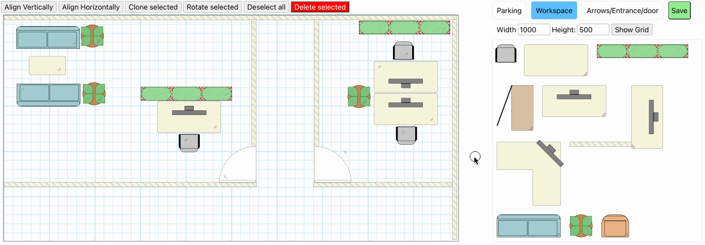
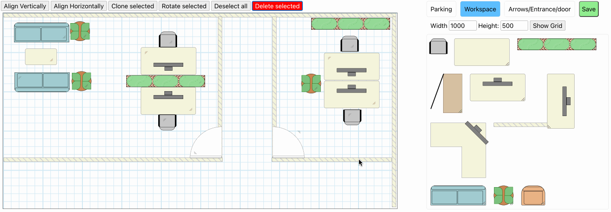
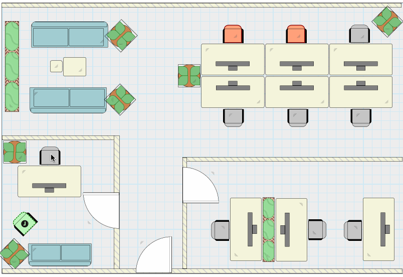
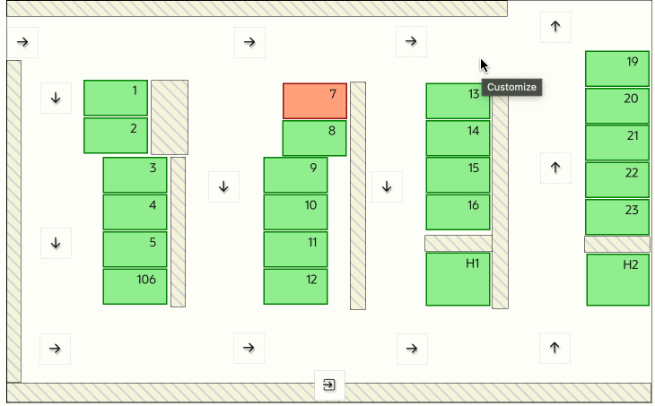
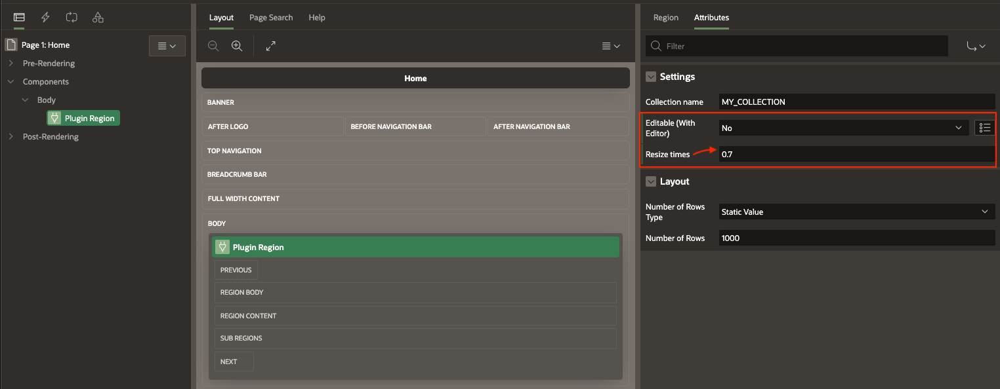
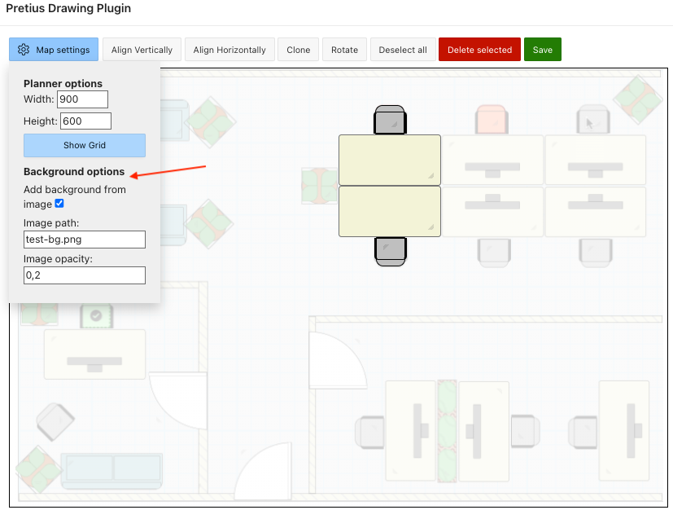
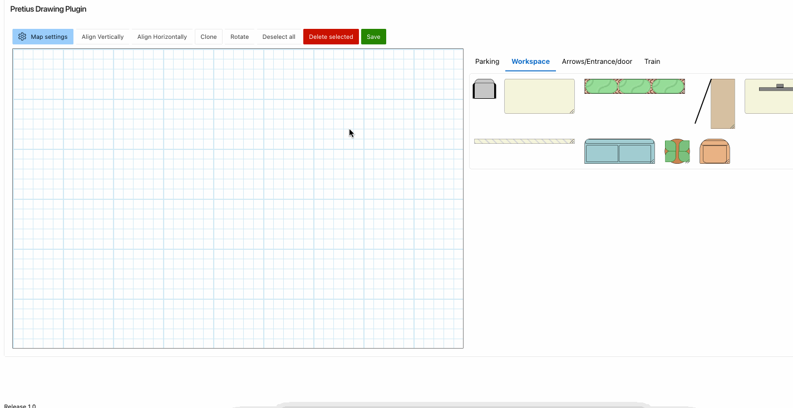
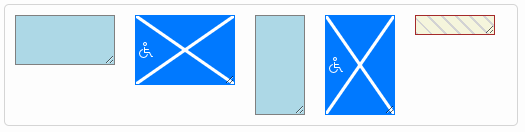
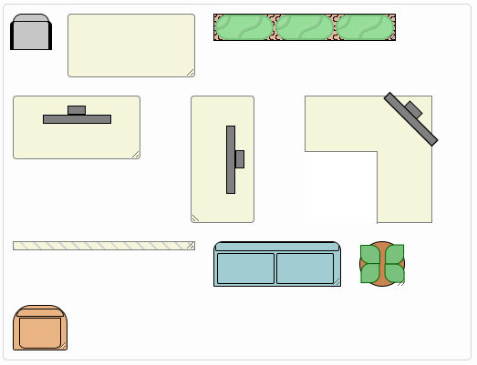
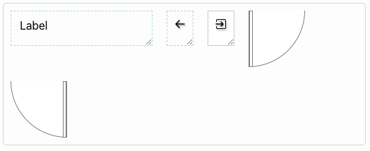

<h1> Pretius Drawing plugin </h1>

  

- [What is Drawing plugin](#what-is-drawing-plugin)
- [Release History](#release-history)
- [Plugin Installation and configuration](#plugin-installation-and-configuration)
- [User Manual](#user-manual)
- [Components settings](#components-settings)
- [Known issues and future development](#known-issues-and-future-development)
- [Calibration](#calibration)
- [License](#license) 
- [Free support](#free-support) 
- [Commercial support](#commercial-support) 

## What is Drawing plugin

Pretius Drawing plugin is an Oracle APEX region plugin developed by Tomas Kucharzyk at <a href="https://www.pretius.com" title="https://www.pretius.com">Pretius</a>. Plugin helps you draw interactive 2D plans and can be used for example as parking or workspace planner and more. Main features of the Pretius Drawing plugin are: 
 - Create drawings with easy drag & drop interface
 - Modular components: User can add components and component types in table and use them without need to change the code
 - Interactivity: User customizable functions for interactive plans
 - Save and load from collection
 - Adapt the size of the plan to screen size
 - Add plan background to place components with ease 

<div  style="float: left"><p  align="center">

</p></div>

<div  style="float: left"><p  align="center">

</p></div>


## Release History
1.0: October 2023

 - Initial version

1.1: October 2023

 - Fixed compatibility with 22.2.
 - Changed the logic of save and load to increase maximum count of used components
 - Changed inputs in parking spots to text areas

1.2: November 2023

 - Added left and top calibration into region attributes

1.3: December 2023

 - Code changes, plugin can be now used multiple times on one page

1.4: January 2024

 - Added save progress messages
 - New feature - add background image to the plan
 - Removed select functionality from component templates (right panel)
 - Added basic support for touch devices (drag and drop) [Support for touch devices. #3](https://github.com/Pretius/pretius-drawing-plugin/issues/3)
 - Bug fixes

1.5: February 2024

 - Added zoom functionality, removed scaling
 - Added deselect of all selected components when click on the planner background

## Plugin Installation and configuration

 First install SQL file with component tables and included components
 You can install the file in SQL Workshop-Scripts where you run it as new script or in your database:
```sql
 type_components.sql
 ```
 Then import the plugin into your application from this file:
```sql
 region_type_plugin_pretius_drawing_plugin.sql
  ```
  For the plugin configuration follow this steps:
  
 1. Create region of type "Pretius Drawing Plugin"
 2. Set collection name in region attributes
 3. Choose if the plugin should be displayed with or without editor:
     1. If the editor is active, users can drag & drop components onto the plan and edit them
     2. Save button will save all the components into chosen collection
     3. When is editor option disabled, user can define onClick behavior in onClick column, so the plan can be interactive and users can for example book a place in an office or parking spot
 4. Set the region query as below:
  
Example query:

```sql
select
	C001 as width,
	C002 as height,
	C003 as  top,
	C004 as left,
	C005 as class,
	C006 as  text,
	C007 as available,
	C008 as spot_id,
	C009 as rotate,
	case  
		when C005 like  '%workspace-seat%'  then  'selectSpot('|| C008 ||')'
		else  'alert('||C008||')'
	end  as onClick,
	c010 as innerHtml
from apex_collections
where collection_name = 'MY_COLLECTION'
order by seq_id;
```
Query contains columns that define component size, location and visualization.
It does not have to use apex_collections, you can load saved results directly from the table.

 - **Width** and **Height**: size of the component
 - **Top** and **Left**: component position
 - **Class**: CSS classes, define component visualization
 - **Text**: if the component contains input field, it will be saved into Text column
 - **Available**: can be used to restrict interactivity of the component
 - **Spot_id**: auto generated id of the component, unique identifier
 - **Rotate**: rotate CSS value in degrees
 - **Onclick**: user defined function that will be triggered on click, example below add function selectSpot(id) to component that has class workspace-seat (Workplace component that visualize as office chair) and alert(id) for any other component 
 ```sql
 case 
	 when C005 like  '%workspace-seat%'  then  'selectSpot('|| C008 ||')'
	 else  'alert('||C008||')'
end  as onClick
 ```
<div  style="float: left"><p  align="center">

</p></div>
<div  style="float: left"><p  align="center">

</p></div>

 - **Innerhtml**: this column contains any inner html from complicated components, when recreated, the inner html is inserted into main component div, so the visualization stays the same

### Change the scale of the plan (zoom in and out)
Change the scale of the planner using plus. minus and fit buttons. 
To control height and width of div containing the plan, you can manually add css to div with class "zoom-additional-container".

<div  style="float: left"><p  align="center">

</p></div>

### Add planner background
To add planner background simply upload the image into Application static files and use the name of the file in plugin background settings. You can also set the opacity of the background.

<div  style="float: left"><p  align="center">

</p></div>
<div  style="float: left"><p  align="center">

</p></div>

## User Manual
[Link to User manual](user_manual.md)

## Components settings
All the components are in table PLAN_TYPE (category of the components) and TYPE_COMPONENT.
You can create additional components / component types and add them into tables. Use code column for your HTML and CSS column for styling. It will be automatically loaded into the plugin and you can use it to create your visualizations.

<div>



</div>
 

## Known issues and future development
 1. Feature: Drag all selected items at once
 2. Error: Some components get selected when draged around or resized

## Calibration
To enhance the precision of drag & drop, we have included Left and Top margin attributes in the region settings. This allows you to fine-tune the drop position.
For more information, please refer to the User Manual: [Link to User manual](user_manual.md)

## License

Licensed under the [MIT](LICENSE.txt).

## Free support
Pretius provides free support for the plugins at the GitHub platform. 
We monitor raised issues, prepare fixes, and answer your questions. However, please note that we deliver the plug-ins free of charge, and therefore we will not always be able to help you immediately. 

Interested in better support? 
* [Become a contributor!](#become-a-contributor) We always prioritize the issues raised by our contributors and fix them for free.
* [Consider comercial support.](#comercial-support) Options and benefits are described in the chapter below.

### Bug reporting and change requests
Have you found a bug or have an idea of additional features that the plugin could cover? Firstly, please check the Roadmap and Known issues sections. If your case is not on the lists, please open an issue on a GitHub page following these rules:
* issue should contain login credentials to the application at apex.oracle.com where the problem is reproduced;
* issue should include steps to reproduce the case in the demo application;
* issue should contain description about its nature.

### Implementation issues
If you encounter a problem during the plug-in implementation, please check out our demo application. We do our best to describe each possible use case precisely. If you can not find a solution or your problem is different, contact us: apex-plugins@pretius.com.

## Become a contributor!
We consider our plugins as genuine open source products, and we encourage you to become a contributor. Help us improve plugins by fixing bugs and developing extra features. Comment one of the opened issues or register a new one, to let others know what you are working on. When you finish, create a new pull request. We will review your code and add the changes to the repository.

By contributing to this repository, you help to build a strong APEX community. We will prioritize any issues raised by you in this and any other plugins.

## Commercial support
We are happy to share our experience for free, but we also realize that sometimes response time, quick implementation, SLA, and instant release for the latest version are crucial. That’s why if you need extended support for our plug-ins, please contact us at apex-plugins@pretius.com.
We offer:
* enterprise-level assistance;
* support in plug-ins implementation and utilization;
* dedicated contact channel to our developers;
* SLA at the level your organization require;
* priority update to next APEX releases and features listed in the roadmap.
