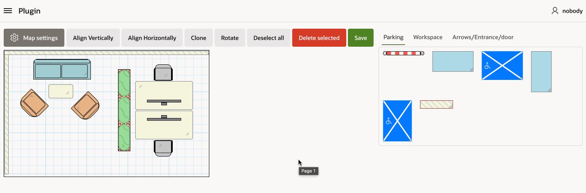
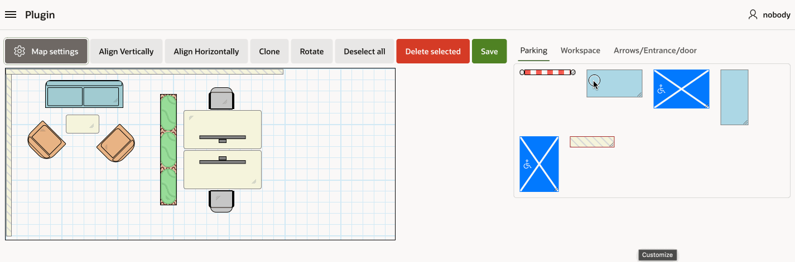
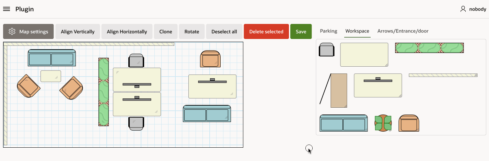
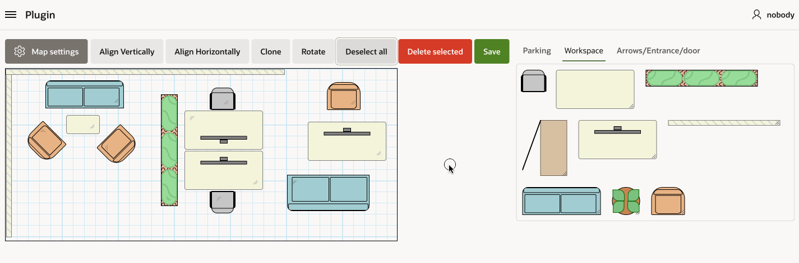
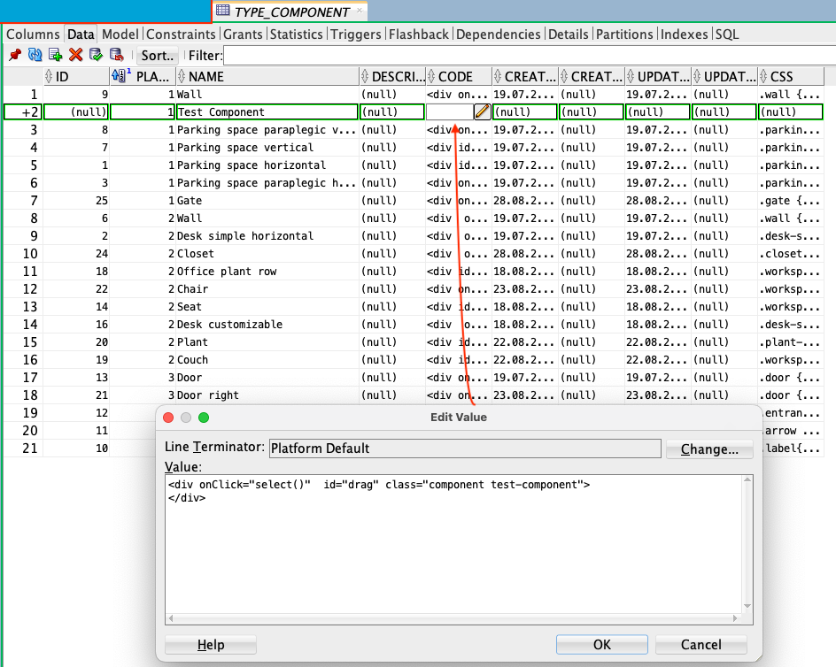
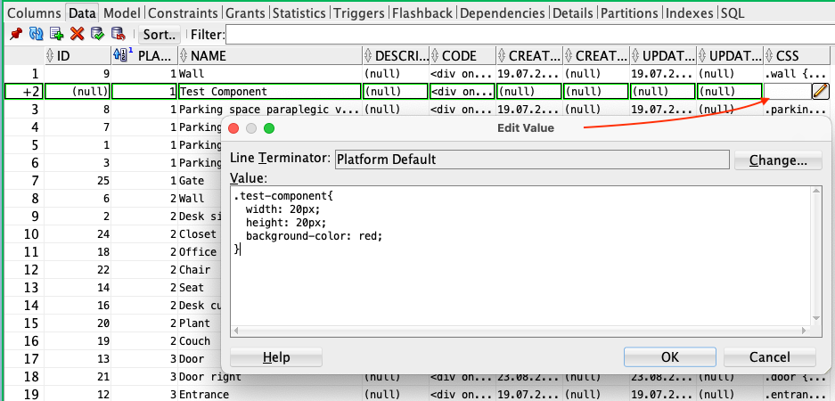
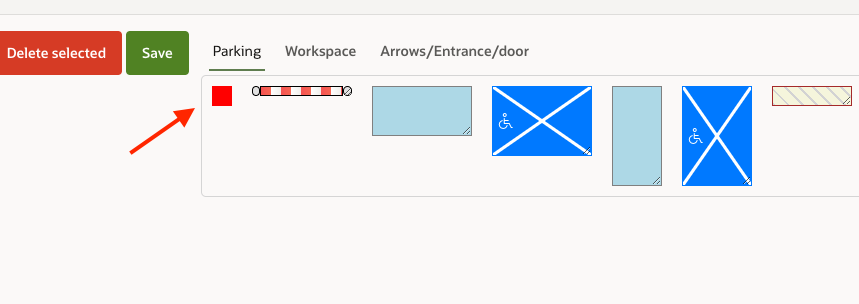
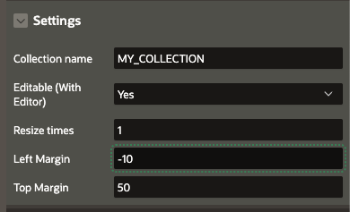

# User manual

## Map/Plan settings 

To adjust settings, click on the map settings button

You can adjust plan size and enable/disable grid background

## Adding components to plan

User can drag and drop components from right pane to plan

## Changing size and angle

User can change component size and rotate it

To adjust the size click right bottom corner of the component and drag

To rotate a component, select it first and click Rotate button

## Removing elements from plan

To remove elements from the plan, click on the elements to select them and then click Delete selected button

## Adding components

To add component, you add html code and css into TYPE_COMPONENT table

It will automatically appear in the plugin right component pane

## Calibration

To adjust the component's drop position, you can use the 'Left Margin' and 'Top Margin' attributes in the region settings.

Drag and drop the component into the planner and pay attention to whether it appears in the correct spot where you dropped it. If not, adjust the margin values and repeat the process.

Margins may need to be adjusted each time you change the region type, padding, or margins.

## Add planner background
To add planner background simply upload the image into Application static files and use the name of the file in plugin background settings. You can also set the opacity of the background. 
After you upload the image file into the static files, use only the actual path to te file without APP_FILES. For example if you have static file with path "#APP_FILES#test-bg.png" use only test-bg.png as path.

